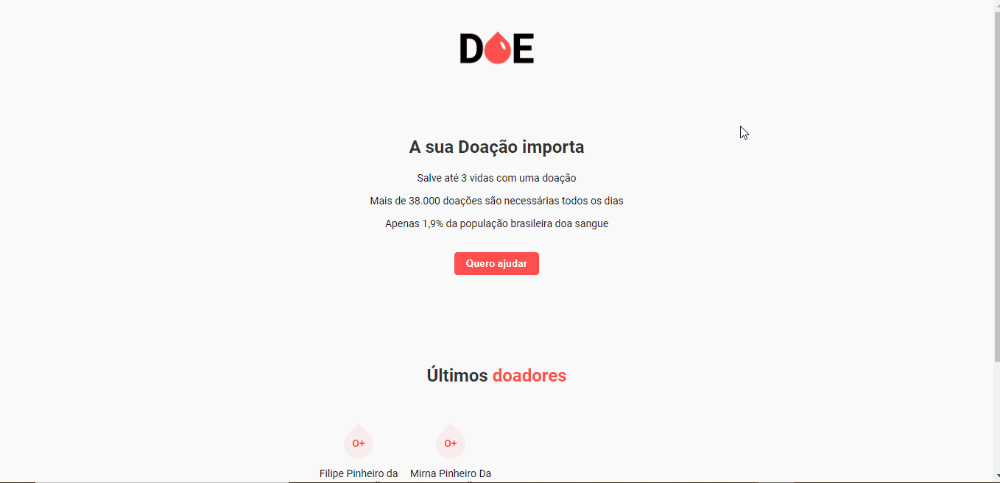

# doe-sangue

 

Esse é um site feito durante a Maratona Dev da Rocketseat!

Ele é simples e simula um formulário do doações de sangue, para executá-lo, siga essas instruções.


1. Instale o yarn no seu computador seguindo as instruções em [Yarn](https://yarnpkg.com/)
2. Instale o [Node](https://nodejs.org/en/)
4. Instale o [PostgreSQL](https://www.postgresql.org/) 
> Durante a instalação você configurará uma senha, lembre dela depois
5. Use o [Postbird](https://www.electronjs.org/apps/postbird) para criar um banco de dados chamado donations e uma tabela chamada donors com nome, email e blood
6. crie um arquivo .env seguindo os [templates](templates/templates.md)
3. Abra a pasta em um terminal e digite os seguintes comandos seguidos
```

yarn
yarn watch 

```
4. O site estará disponível na porta configurada

ps: para conectar ao Postbird o username é postgres, a senha é a configurada na instalação e tem que apagar o campo database que vem preenchido


O site tem esses passos complexos demais para executar, pois ele tem muitas configurações a serem feitas em modo de desenvolvimento. Em breve ele estará em produção e tudo estará simplificado.

Sintam-se a vontade em criar issues, fork e PR :)